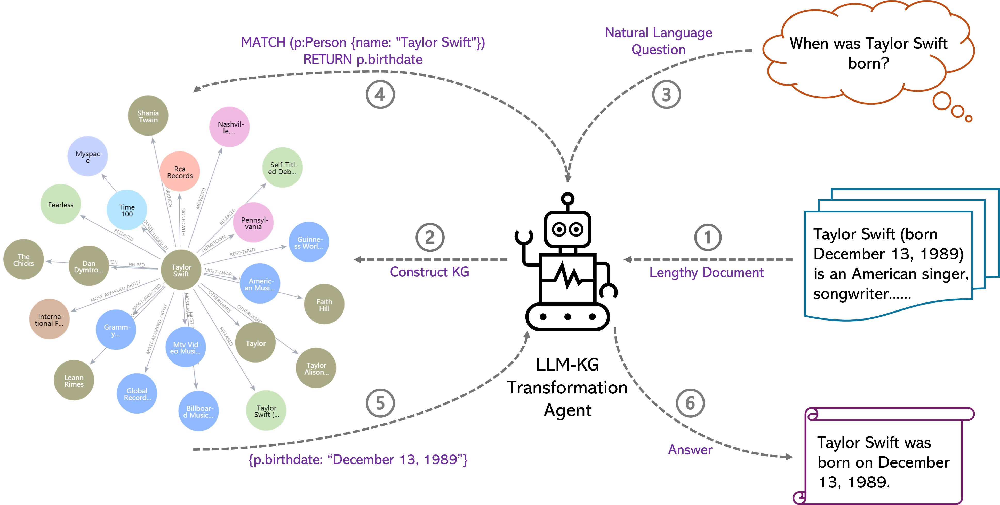

# LLM-KG: Enhancing Large Language Model Comprehension with Knowledge Graph Construction

[--- LLM-KG Paper ---](https://drive.google.com/file/d/10k0esjnanK5GTch6pJy5pPh9Vo4aZIbo/view?usp=sharing)

## Folders
The repository structure is as follows:
```
├─LEval-data
│  ├─codeU.jsonl
│  ├─coursera.jsonl
│  ├─gsm100.jsonl
│  ├─quality.jsonl
│  ├─sci_fi.jsonl
│  └─tpo.jsonl
├─Predictions
│  └─exam_eval
│      └─turbo-16k-12-30-11-59
│          └─tpo.pred.jsonl
└─figures
```

## Quick Start
### Requirements
To get started, you need `python=3.11`, and run:
```
pip install -r requirements.txt
```
You also need to set up a Neo4j database for our KG usage. A convenient way is to start a free instance on [Neo4j Aura](https://neo4j.com/cloud/platform/aura-graph-database/?ref=nav-get-started-cta), which offers Neo4j cloud instances. Then, modify [config.yaml](./config.yaml) to include your Neo4j configuration and Openai API key.
```
# Neo4j database configuration
neo4j_config:
  url: "neo4j+s://your-neo4j-URL"
  username: "neo4j"
  password: "your-neo4j-password"

# Openai API key
openai_api_key: "your-openai-api-key"
```

### Load Data
You can load the 6 test data from huggingface datasets:
```
from datasets import load_dataset, disable_caching

datasets = ["coursera", "gsm100", "quality", "tpo", "codeU", "sci_fi"]
# The corresponding dataset names in the paper 'L-Eval': ["coursera", "GSM(16-shot)", "QuALITY", "TOFEL", "codeU", "SFiction"]

for testset in datasets:
    # disable_caching()  # Uncomment this if you cannot download codeU and sci_fi 
    data = load_dataset('L4NLP/LEval', testset, split='test')
```

You can also directly load the test data from [LEval-data](./LEval-data/).

#### Test Data Format
The format of each sample is as follows:
```
{
    "instructions": ["why did frantzen go to the sales barn\nA. to study human form and movement\nB. to earn money by painting portraits\nC. to paint farm animals in an outdoor setting\nD. to meet people who could model for her paining", "..."], // a list of questions (queries) that LLMs need to answer
    "outputs": ["A", "C", "C", "B", "B", "D", "B", "B", "..."], // the ground truth or reference of corresponding instructions (questions)
    "input": "OK, I'm going to begin this lecture by giving you your next assignment as well, the exhibition that I want you to attend is coming up......", // A very long document that LLMs need to respond to instructions based on it
    "source": "toefl_tpo", // Domain the document belongs to: meeting, toefl_tpo, narrative_qa, etc.
    "evaluation": "exam" // Metrics used for evaluation: exam, human, LLM, ROUGE, F1, etc.
}
```

### Generate Prediction
To generate prediction results on test data, you can run the following command and the prediction files will be saved in [Predictions/exam_eval](./Predictions/exam_eval/).
```
python main.py  --metric exam_eval  --task_name tpo
```

### Evaluation
To perform evaluation on the generated prediction results, you can run:
```
python auto_eval.py --pred_file Predictions/exam_eval/turbo-16k-12-30-11-59/tpo.pred.jsonl
```

## Demo
You can run a quick demo to see how LLM-KG works:
```
python main.py  --metric exam_eval  --demo
```
The script will first extract articles about 'Taylor Swift' from Wikipedia, then take the first three to construct a Knowledge Graph (KG) for demo. When the KG is prepared, we will perform three Q&A test as follows:
```
Perform Q&A Test...
Query: When was Taylor Alison Swift born?
Result: Taylor Alison Swift was born on December 13, 1989.

Query: Which album does the song 'Shake It Off' belong to?
Result: The song "Shake It Off" belongs to the album "1989" by Taylor Swift.

Query: Taylor Swift's hometown is in Illinois, True or False?
Result: False.
```

[--- Demo Video ---](https://drive.google.com/file/d/1iUwfdZS00M7qWa99aZy6Vbn0exZB3nyi/view?usp=sharing)
